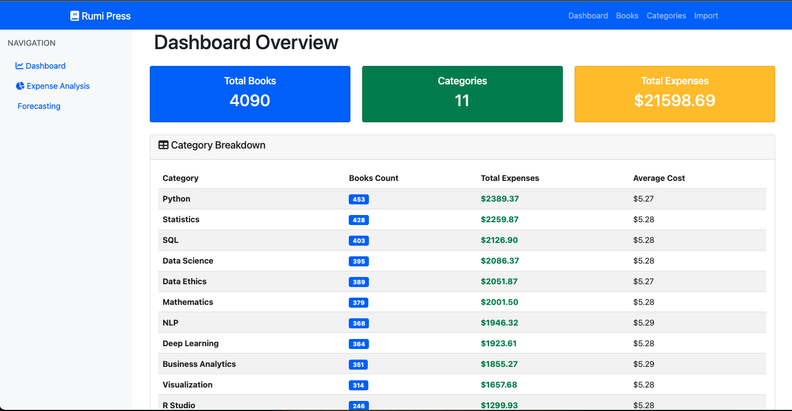
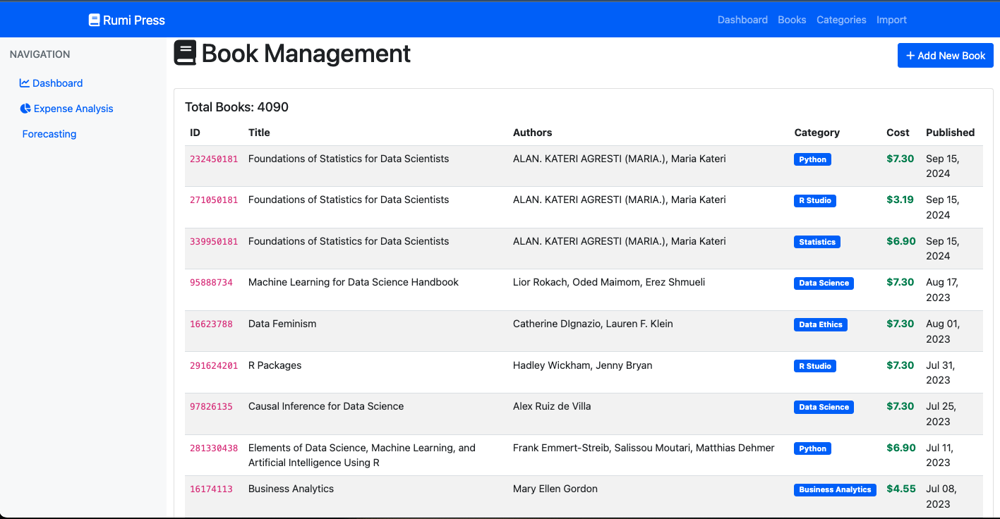
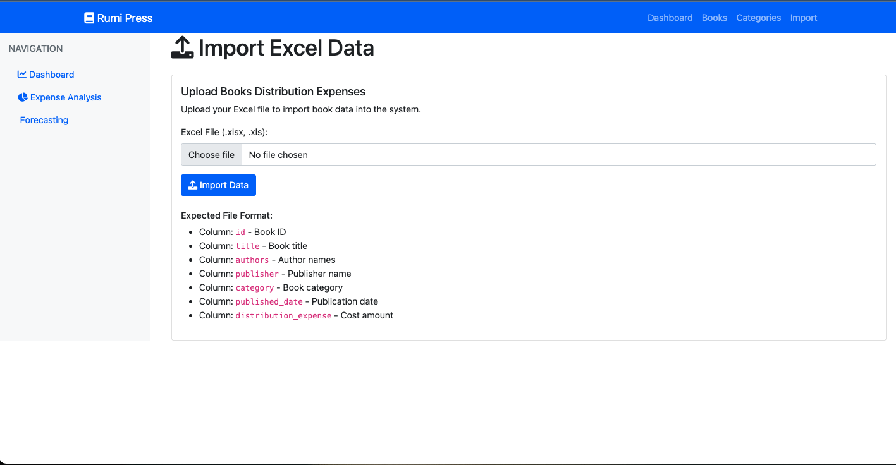

# rumi-press-expense-tracker
A Django web application for tracking book distribution expenses. Built to replace a manual spreadsheet workflow with automated Excel import, a searchable book database, and a simple analytics dashboard.
/das

## What it does
 
- **Imports book data from Excel files** — parses `.xlsx`/`.xls` with validation, duplicate handling, and error reporting
- **Tracks distribution expenses** across book categories with full CRUD operations
- **Provides a dashboard** showing totals, category breakdowns, and average costs
Working dataset: ~4,090 books across 11 categories, tracking ~$21,600 in distribution expenses.
 
## Tech stack
 
- **Backend:** Django 4.2, Python 3.11, Pandas + OpenPyXL for Excel processing
- **Frontend:** Bootstrap 5, HTML/CSS/JS
- **Database:** SQLite (development)
- **Deployment:** Docker + docker-compose

## Running it
 
```bash
git clone https://github.com/Sindhu-tron/rumi-press-expense-tracker.git
cd rumi-press-expense-tracker
python -m venv venv
source venv/bin/activate
pip install -r requirements.txt
python manage.py migrate
python manage.py createsuperuser
python manage.py runserver
```
 
Visit `http://127.0.0.1:8000`.
 
Or with Docker:
 
```bash
docker-compose up
```

## Screenshots
 
**Dashboard** — expense totals and category breakdown
 screenshots/Book categories screenshot.png
 
**Book list** — searchable, filterable

 
**Excel import** — upload with progress and error reporting


## Project structure
 
```
├── books/              # Book management app (models, views, forms)
├── reports/            # Dashboard and analytics views
├── templates/          # HTML templates
├── static/             # CSS, JS, images
├── screenshots/        # README images
├── Dockerfile
├── docker-compose.yml
├── requirements.txt
└── manage.py
```
 
## What I'd do differently
 
The analytics are basic Django ORM aggregations rendered as HTML. For a real analytics use case I'd add Plotly or Chart.js for interactive charts and expose a REST API for external BI tools. The import pipeline also has no async processing — for genuinely large files, Celery with a task queue would be the right move.
 
## Author
 
Sindhuja Dantuluri — [LinkedIn](https://www.linkedin.com/in/SindhujaDantuluri/)
 
## Licence
 
MIT

